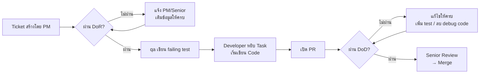

# 1.5 Definition of Ready & Definition of Done

| รายการ | รายละเอียด |
|---|---|
| โปรเจกต์ | Lucky Draw วงล้อนำโชค |
| เวอร์ชัน | 2.0 |
| สถานะ | Draft รอทีมตกลงร่วมกัน (ดูตารางลงนามท้ายเอกสาร) |
| อ้างอิง | SOP `ref/01_REQUIREMENTS/1.5_Definition_of_Ready_Done.md`, [1.3 Acceptance Criteria](1.3_Acceptance_Criteria.md), [task.md](task.md) |

## ภาพรวม

```
DoR                          DoD
"Ticket พร้อมหยิบทำหรือยัง?"  "งานเสร็จจริงพร้อม merge หรือยัง?"
─────────────────────────────────────────────────────────────────
  ก่อนเริ่ม Code         →         ก่อน Merge PR
```

ข้อแตกต่างจาก template ของ SOP ในโปรเจกต์นี้
- ไม่มี database (D-01) งานที่ SOP ต้องมี "DB Schema" ใช้ **Sheet Data Design** แทน (โครงคอลัมน์แท็บบูธ แท็บ `Prizes` แท็บ `คงเหลือ` และ contract ของ Apps Script)
- ดีไซน์ใช้ `lucky-spin.html` เป็น baseline (D-02) งาน UI ใช้ภาพ baseline แทน wireframe ใหม่
- งานทุกชิ้นใช้ TDD: `qa` เขียน failing test จาก AC ก่อน developer เริ่ม implement

---

## Definition of Ready (DoR)

### DoR Checklist — ใช้ได้ทุกประเภท Task

| # | เงื่อนไข | ใครรับผิดชอบ |
|---|:---------|:------------|
| 1 | มี **Task Description** อธิบายว่าต้องทำอะไร | PM / Senior |
| 2 | มี **Acceptance Criteria** อย่างน้อย 1 ข้อ อ้าง AC ID จาก 1.3 | PM / Senior |
| 3 | Task ขนาด **ทำเสร็จได้ใน 1–3 วัน** (ถ้าใหญ่กว่านี้ต้อง break down) | Senior |
| 4 | มี **Story Points / Time Estimate** ที่ประเมินร่วมกัน | Senior + Junior |
| 5 | ไม่มี **Blocker** ที่ยังแก้ไม่ได้ (รวม Open Question ที่ task นั้นขึ้นอยู่ เช่น Q1 สำหรับโควตารายชั่วโมง) | ทุกคน |
| 6 | มี **owner tag** หนึ่งค่า: `qa`, `backend-engineer`, `frontend-engineer` | PM |
| 7 | Failing test ของ AC ที่เกี่ยวข้องมีอยู่แล้ว (ยกเว้น task เขียน test เอง และ task scaffold) | `qa` |

### DoR เพิ่มเติมตามประเภทงาน

#### งาน UI / Frontend

| # | เงื่อนไขเพิ่มเติม |
|---|:-----------------|
| 8 | มี **ภาพ baseline** จาก `lucky-spin.html` ของ state ที่เกี่ยวข้อง (แทน wireframe ตาม D-02) หรือ mockup สำหรับหน้าที่ไม่มีใน baseline (แท็บของรางวัลแบบอ่านอย่างเดียว, วงล้อปิด) |
| 9 | ระบุ **Responsive**: เดสก์ท็อป ≥ 960px และมือถือ/แท็บเล็ตแนวตั้ง (375px ต้องไม่แตก) |

#### งาน API / Backend

| # | เงื่อนไขเพิ่มเติม |
|---|:-----------------|
| 8 | มี **API Spec** (endpoint, method, request/response ตามรูปแบบมาตรฐาน SOP, status code) |
| 9 | มี **Sheet Data Design** ที่เกี่ยวข้อง (แทน DB Schema) และ contract ของ action Apps Script ที่เรียก |

#### งาน Apps Script (`Code.gs`)

| # | เงื่อนไขเพิ่มเติม |
|---|:-----------------|
| 8 | มี contract ของ action (request/response, `reason` ทุกค่า) |
| 9 | มีชีตจำลองสำหรับ test (`code.test.js`) ครอบคลุม case ที่แก้ |

#### งาน Bug Fix

| # | เงื่อนไขเพิ่มเติม |
|---|:-----------------|
| 8 | มี **Steps to Reproduce** ที่ทำซ้ำได้ |
| 9 | มี **Expected vs Actual** behavior |

### วิธีเขียน DoR ใน Task Ticket

```markdown
## Task Description
[อธิบายสิ่งที่ต้องทำ 1-3 ประโยค]

## Owner
[qa | backend-engineer | frontend-engineer]

## Acceptance Criteria
- [ ] [AC ID]: [เงื่อนไข]

## Reference
- Baseline / Mockup: [ลิงก์]
- API Spec / Sheet Data Design: [ลิงก์]

## DoR Checklist
- [ ] Description ชัดเจน
- [ ] AC ครบ
- [ ] ขนาดไม่เกิน 3 วัน
- [ ] Estimate แล้ว
- [ ] ไม่มี blocker / open question ค้าง
- [ ] Failing test มีแล้ว
```

### ตัวอย่าง: Task ที่ผ่าน DoR

```
Title: [Feature] POST /api/spin สุ่มรางวัลฝั่ง backend (T-504)

## Task Description
สร้าง endpoint หมุนวงล้อ: รับแถวและชื่อผู้เล่น ถือ lock ต่อบูธ อ่านจำนวนแจกแล้ว
สุ่มด้วย crypto randomness เขียนผลผ่าน Apps Script แล้วคืนรางวัลพร้อมสถานะวงล้อ

## Owner
backend-engineer

## Acceptance Criteria
- [ ] AC-032-01, AC-032-02, AC-032-03
- [ ] AC-033-01, AC-033-02, AC-033-04
- [ ] AC-034-01, AC-034-02
- [ ] AC-017-02, AC-017-03

## Reference
- API Spec: docs/design/api-spec.md (T-302)
- Sheet Data Design: docs/design/sheet-data-design.md (T-301)

## DoR Checklist
- [x] Description ชัดเจน
- [x] AC ครบ
- [x] ขนาดไม่เกิน 3 วัน (ประเมิน 2 วัน)
- [x] Estimate แล้ว (5 Story Points)
- [x] ไม่มี blocker (ไม่ขึ้นกับ Q1: โควตาอยู่ใน T-506)
- [x] Failing test มีแล้ว (T-402, T-404)
```

---

## Definition of Done (DoD)

### DoD Checklist — ใช้ได้ทุกประเภท Task

| # | เงื่อนไข | ใครตรวจ |
|---|:---------|:-------|
| 1 | Code ทำงานตาม **Acceptance Criteria** ครบทุกข้อ (test ของ AC ผ่าน) | Junior (self-check) |
| 2 | เขียน **Unit Test** สำหรับ logic ใหม่ ก่อน implement (TDD) | Junior / `qa` |
| 3 | **Sandbox checks ผ่าน** — Lint, Type-check, Tests, Build ไม่มี error | Sandbox อัตโนมัติ |
| 4 | ไม่มี `console.log` / debug code / hardcode (URL, token, รหัส, ชื่อแท็บนอก config) ค้าง | Junior (self-review) |
| 5 | **Peer Review ผ่าน** — ไม่มี MUST comment ค้าง | Senior |
| 6 | **Task Ticket** ลิงก์อยู่ใน PR Description และสถานะใน `task.md` เป็น `[x]` | Junior |
| 7 | **Documentation** อัปเดตแล้ว (ถ้ามี API/Flow ใหม่) รวม README และ `.env.example` | Junior |
| 8 | **Container** — Dockerfile ของ service ที่แก้อัปเดตแล้ว และ `docker compose up --build` ที่ root รันได้ | Junior + Senior |

### DoD เพิ่มเติมตามประเภทงาน

#### งาน UI / Frontend

| # | เงื่อนไขเพิ่มเติม |
|---|:-----------------|
| 9 | หน้าตาตรงกับ **baseline** (AC-043-01) หรือ mockup ที่อนุมัติ |
| 10 | **Responsive** ทำงานได้ที่เดสก์ท็อป ≥ 960px, แท็บเล็ตแนวตั้ง และ 375px |
| 11 | มีสถานะ loading, empty, error ของทุกจุดที่เรียก API; Tab + Enter/Space ใช้ได้; reduced-motion ทำงาน |

#### งาน API / Backend

| # | เงื่อนไขเพิ่มเติม |
|---|:-----------------|
| 9 | **API Response** ตรงตาม spec (status code, รูปแบบ `{ success, data }` / `{ success: false, message }`) |
| 10 | **Error handling** ครบ (Zod 400, 401, 409, 413, 429, 502, 500 ไม่เปิดเผยข้อความภายใน) |
| 11 | Integration test (Supertest) ของ endpoint ผ่านอย่างน้อย happy path + error หลัก |

#### งาน Apps Script (`Code.gs`)

| # | เงื่อนไขเพิ่มเติม |
|---|:-----------------|
| 9 | `code.test.js` ผ่านกับชีตจำลอง |
| 10 | Deploy เวอร์ชันใหม่ใน Apps Script แล้ว URL เดิมยังใช้ได้ และบันทึกเลขเวอร์ชันใน PR |

#### งาน Bug Fix

| # | เงื่อนไขเพิ่มเติม |
|---|:-----------------|
| 9 | Bug **ทำซ้ำไม่ได้แล้ว** ตาม Steps to Reproduce |
| 10 | เพิ่ม **test case** สำหรับ bug นี้ (ป้องกัน regression) |

### วิธีใช้ DoD กับ PR

```markdown
## DoD Checklist
- [ ] AC ครบทุกข้อ (ระบุ AC ID)
- [ ] Unit Test เขียนก่อน implement และผ่าน
- [ ] Sandbox checks ผ่าน (lint, type-check, test, build)
- [ ] ไม่มี console.log / hardcode / secret
- [ ] Task Ticket ลิงก์แล้ว และ task.md อัปเดตแล้ว
- [ ] Docs / .env.example อัปเดตแล้ว (ถ้ามี)
- [ ] docker compose up --build ผ่าน
```

> Junior ต้องติ๊กให้ครบก่อน Request Review
> Senior ตรวจ DoD ก่อนกด Approve

---

## สรุป: DoR vs DoD

| | DoR | DoD |
|---|:---|:---|
| **ใช้เมื่อ** | ก่อนเริ่ม code | ก่อน merge PR |
| **ตรวจโดย** | Junior ตรวจ ticket ว่าพร้อมหรือยัง | Junior self-check + Senior review |
| **ถ้าไม่ผ่าน** | ห้ามเริ่ม code → แจ้ง PM/Senior | ห้าม merge → แก้ให้ครบก่อน |
| **เป้าหมาย** | ลดเวลาเสียจากข้อมูลไม่ครบ | ลด bug ที่หลุดเข้า staging |



---

## การตกลงของทีม

| บทบาท | ชื่อ | ตกลง DoR/DoD | วันที่ |
|---|---|---|---|
| Product Owner | | รอ | |
| Senior (backend-engineer) | | รอ | |
| Senior (frontend-engineer) | | รอ | |
| QA | | รอ | |
